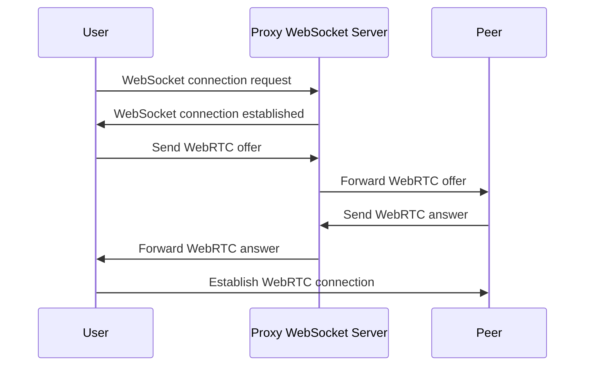

# Initial connection sequence

```mermaid
sequenceDiagram
    participant User
    participant ProxyServer as Proxy WebSocket Server
    participant Peer as Peer

    User->>ProxyServer: WebSocket connection request
    ProxyServer->>User: WebSocket connection established
    User->>ProxyServer: Send WebRTC offer
    ProxyServer->>Peer: Forward WebRTC offer
    Peer->>ProxyServer: Send WebRTC answer
    ProxyServer->>User: Forward WebRTC answer
    User->>Peer: Establish WebRTC connection
```
